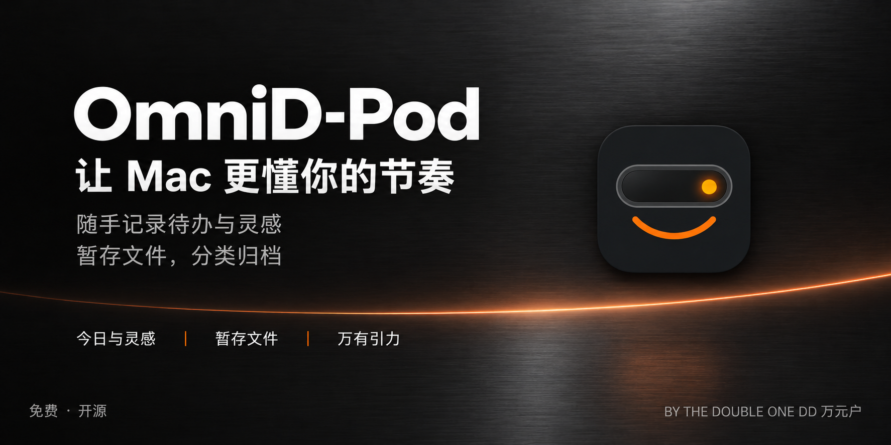

# OmniD-Pod

[简体中文](#简体中文) · [English](#english)

## 简体中文

免费的 macOS 刘海工具。把今日清单、灵感、暂存文件和万有引力归档放在随手可用的位置。

**免费使用、开放源码，无订阅、付费解锁或激活码。** 可选 Gemini 功能使用你自己的 API 密钥；Google 可能按你的账号方案收费，OmniD-Pod 不代收费用。

### 下载与使用

- [免费下载未公证预览版](https://github.com/wangyinhe3939/OmniD-Pod/releases/tag/v1.0.0-preview.293)：安装前请阅读页面的签名与系统限制。
- [全部版本](https://github.com/wangyinhe3939/OmniD-Pod/releases)：以后的网站下载按钮也指向本项目 Release。
- [使用与当前限制](交付说明.md)：安装、权限、归档和手机快捷指令。
- [工程与构建](PROJECT.md)：架构、依赖、构建及测试入口。
- [报告问题](https://github.com/wangyinhe3939/OmniD-Pod/issues)：请先隐去个人笔记、文件路径和密钥。

当前候选适用于 **Apple Silicon、macOS 15.0 或更新版本**。现有候选仅作本机临时签名，尚未完成 Developer ID 签名与 Apple 公证；以每次 Release 标明的签名状态为准。源码公开不代表安装包已通过跨机器验收。

### 可以做什么

- **今日与灵感**：记录清单、灵感和项目，可选择连接 Apple 提醒事项。
- **暂存文件**：集中保留文件引用，方便拖出、预览与分享。
- **万有引力**：文字、网址、图片和文件按四类归档，在 Obsidian 中追加总索引。
- **可选智能识别**：主动点击后用 Gemini 提炼网址或建议图片名称；失败回退普通记录。
- **手机与平板中转**：从 App 添加原生快捷指令，经用户授权的 iCloud 文件夹传回 Mac。
- **刘海工具**：媒体、日历、电池、系统提示与键盘清洁，按功能申请相应权限。

### 数据与权限

普通记录和归档不需要 OmniD-Pod 账号。归档位置和 Obsidian 笔记库由你通过系统选择器授权；不会默认双云写入。开启智能识别后，也只有主动点击「智能处理」才会发送相关网址或图片预览给 Google。密钥保存在本机钥匙串。

iCloud / Google Drive 的同步由各自服务完成；本地保存成功不等于另一台设备已收到。源文件、索引和失败恢复规则见[工程说明](PROJECT.md)。

### 开源与参与

本工程基于 [TheBoredTeam / Boring Notch](https://github.com/TheBoredTeam/boring.notch)，由 Double One 进行中文界面、工作区工具和万有引力等改造。保留上游作者署名。

项目沿用 [GNU GPL v3](LICENSE)；依赖各自的声明见 [THIRD_PARTY_LICENSES](THIRD_PARTY_LICENSES)，早期功能来源见 [OFFKEY 融合说明](OFFKEY-INTEGRATION-NOTICE.md)。免费发行不额外限制 GPL 授予的修改和再分发权利。

参与前请读[贡献说明](CONTRIBUTING.md)和[安全说明](SECURITY.md)。

---

## English

A free macOS notch utility that keeps your daily to-dos, ideas, file shelf, and archiving tools close at hand.

**Free to use and open source, with no subscriptions, paid unlocks, or activation codes.** Optional Gemini features use your own API key. Google may charge according to your account's plan; OmniD-Pod does not collect those fees.

### Download and get started

- [Download the free unnotarized preview](https://github.com/wangyinhe3939/OmniD-Pod/releases/tag/v1.0.0-preview.293): read the signing status and system requirements on the release page before installing.
- [All releases](https://github.com/wangyinhe3939/OmniD-Pod/releases): the future website's download button will also link to this project's releases.
- [Usage guide and current limitations](交付说明.md) (Chinese): installation, permissions, archiving, and mobile shortcuts.
- [Architecture and build instructions](PROJECT.md) (Chinese): project structure, dependencies, build commands, and tests.
- [Report an issue](https://github.com/wangyinhe3939/OmniD-Pod/issues): remove personal notes, file paths, and API keys before posting.

The current preview targets **Apple Silicon Macs running macOS 15.0 or later**. It has an ad-hoc signature and has not completed Developer ID signing or Apple notarization. Check each release for its actual signing status. Publishing the source does not mean the installer has been validated on other Macs.

### What it does

- **Today & Inspiration (今日与灵感)**: capture to-dos, ideas, and projects, with optional Apple Reminders integration.
- **File Shelf (暂存文件)**: keep file references together for convenient dragging, previewing, and sharing.
- **Archiving & indexing (万有引力)**: organize text, URLs, images, and files into four categories, and append entries to a master index in Obsidian.
- **Optional AI assistance**: when you request it, Gemini summarizes a URL or suggests an image filename. If processing fails, the app falls back to regular recording.
- **iPhone and iPad transfers**: add native Apple Shortcuts from the app and send items to your Mac through an iCloud folder you authorize.
- **Notch tools**: media, calendar, battery, system feedback overlays, and keyboard cleaning, with permissions requested as needed for each feature.

### Data and permissions

Regular recording and archiving do not require an OmniD-Pod account. You choose and authorize the archive location and your Obsidian vault through the system folder picker; the app does not write duplicate archives to two cloud services by default. Even with AI enabled, URLs or image previews are sent to Google only when you explicitly click “智能处理” (smart processing). Your API key is stored in your Mac's Keychain.

iCloud and Google Drive handle their own synchronization. Saving successfully on this Mac does not mean another device has received the item. See the [project guide](PROJECT.md) (Chinese) for source-file handling, indexing, and failure recovery.

### Open source and contributing

This project is based on [TheBoredTeam / Boring Notch](https://github.com/TheBoredTeam/boring.notch). Double One added the Chinese interface, workspace tools, 万有引力 archiving, and other changes. Upstream author credits are retained.

The project continues under the [GNU GPL v3](LICENSE). Dependency notices are in [THIRD_PARTY_LICENSES](THIRD_PARTY_LICENSES), and earlier feature provenance is documented in the [OFFKEY integration notice](OFFKEY-INTEGRATION-NOTICE.md). Free distribution does not impose additional restrictions on the modification and redistribution rights granted by the GPL.

Please read the [contributing guide](CONTRIBUTING.md) and [security policy](SECURITY.md) (both in Chinese) before participating.
